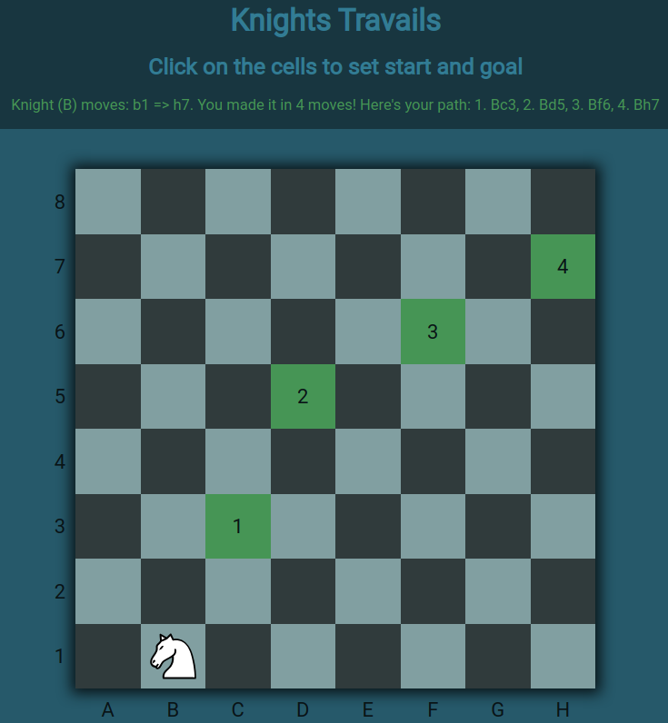

# The Odin Project - Knights Travails

This is a solution to the [The Odin Project Knights Travails project](https://www.theodinproject.com/lessons/javascript-knights-travails). The Odin Project challenges help you improve your coding skills by building realistic projects. 

## Table of contents

- [Overview](#overview)
  - [Screenshot](#screenshot)
  - [Links](#links)
- [My process](#my-process)
  - [Built with](#built-with)
  - [Continued development](#continued-development)
  - [Useful resources](#useful-resources)
- [Author](#author)
- [Acknowledgments](#acknowledgments)

## Overview

### Screenshot

### Links

- Solution URL: [Github repository](https://github.com/BalazsBanfi/Knights-Travails)
- Live Site URL: [Github page](https://balazsbanfi.github.io/Knights-Travails)

## My process

I chosed a different method, instead of working with nodes, queues and stacks, I store the {number of steps, path} in every chess-field. In this case the end-field stores the results also.

### Built with

- JavaScrip
- Multidimensional array for the chess fields
- Store values in objects
- Recursion

### Continued development

I would like to be comfortable with JavaScript methods, responsive web design techniques, css grid, flexbox and JavaScript and want to perfect mobile-first method.

### Useful resources

- [The Odin Project](https://www.theodinproject.com/dashboard/) - High quality coding education maintained by an open source community.

- [Homepage of Kevin Powell](https://www.kevinpowell.co/) - Kevin helpes a lot in responsive techniques. I really liked his teaching style and will follow him in the future also.

## Author

- Website - [Bánfi Balázs](https://github.com/BalazsBanfi)
- Frontend Mentor - [@bally4h](https://www.frontendmentor.io/profile/bally4h)
- Linkedin - [@banfibalazs](https://www.linkedin.com/in/banfibalazs/)

## Acknowledgments

Thanks for the helps to CS50, The Odin Project, Frontend Mentor, freecodecamp.org, Web Dev Simplified, Kevin Powell and many more..